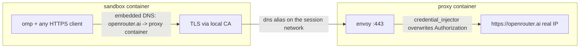

# omp-sandbox

The omp coding agent in an [OrbStack](https://orbstack.dev) (docker)
sandbox behind a credential-injecting envoy proxy, with **no leakable
credentials inside**.



- The sandbox carries only **dummy** key env vars
  (`dummy-replaced-by-proxy`) so omp considers the providers available
  without holding real credentials.
- The proxy advertises the upstream hostnames (`openrouter.ai`,
  `api.neuralwatt.com`) as compose **network aliases**: docker's
  embedded DNS resolves them to the proxy for every container on the
  per-session project network. No static IPs, no /etc/hosts overrides,
  no shared network namespace. Aliases are network-wide, so the proxy
  exempts itself: `container/proxy-entrypoint.sh` parses the
  host-forwarder address out of docker's generated resolv.conf
  (`# ExtServers: [host(<ip>)]`) and points the container's resolver
  straight at it before envoy starts -- bypassing embedded DNS and any
  alias loop while keeping resolution on the host's stack -- no WARP
  interaction, no hardcoded OrbStack-internal address. If discovery or
  the alias-escape check fails the container exits before envoy binds,
  which is the only loud failure mode available (the compose
  healthcheck is a bare TCP connect and envoy binds regardless of
  upstream DNS health).
- AAAA queries for an alias get an empty answer from embedded DNS --
  nothing leaks to real DNS, and Bun's happy eyeballs has no IPv6
  route to race anyway. The old hosts-file design needed paired
  `127.0.0.1`/`::1` pins for this; aliases make it structural.
- The proxy terminates TLS with a tofu-issued, infisical-stored cert handed
  to envoy purely via its environment, no key material on disk (the sandbox
  image bakes the CA into its trust store, plus `NODE_EXTRA_CA_CERTS` for Bun),
  **overwrites** the `Authorization` header with the real key, and forwards
  to actual openrouter.ai, which in *that* container resolves to the real IP.
- Bypass test: from inside the sandbox, hitting the real openrouter.ai IP
  directly with the in-sandbox key returns 401. There is nothing to leak.
- Red-teamed 2026-08-02 (see red-team notes at the end of this section):
  an earlier iteration that shared the proxy's network namespace and left
  envoy's upstream TLS unverified leaked the real OpenRouter key. The
  current controls, each independently chain-breaking:
  - **envoy verifies upstream certificates** (CA bundle + exact-SAN match
    per cluster in `container/envoy.yaml`): a hijacked resolution now
    yields a refused handshake, not a credential handoff.
  - **sandbox drops NET_RAW and NET_ADMIN**: no loopback/L2 sniffing or
    packet forgery from inside, and no route/firewall manipulation --
    everything else stays, so in-sandbox `dnf install` keeps working.
  - **no shared network namespace**: the proxy's DNS never traverses a
    wire the sandbox can read or write.

(Runtime history: previously apple/container; dropped over its
bridge-ifnet collision bug,
[apple/container#2051](https://github.com/apple/container/issues/2051),
which silently kills a NAT network's egress.)

Red-team notes (2026-08-02, full credential exfiltration from inside the
sandbox, pre-hardening): the sandbox shared the proxy's network
namespace, so loopback was shared too. With default docker capabilities
(`CAP_NET_RAW`), that made envoy's upstream DNS (getaddrinfo -> docker
embedded DNS at 127.0.0.11, every ~5s LOGICAL_DNS refresh) fully
observable AND forgeable: sniff the query on lo, answer it first with an
injected raw packet -- reports must ride the victim flow's conntrack
entry (forge the reply from the observed DNAT port, e.g. 52274, so NAT
de-mangles it; a straight-from-:53 forgery is dropped before reaching
the connected resolver socket). Envoy's `UpstreamTlsContext` carried
only `sni:` -- no `validation_context` means NO upstream certificate
verification -- so the poisoned cluster dialed an attacker-chosen IP
(httpbin.org's ALB accepts arbitrary SNI and echoes request headers),
the credential injector dutifully overwrote `Authorization` with the
REAL key, and the echo body returned through the proxy to the sandbox.
Fixes are the three controls listed above.

## Run

```sh
./scripts/up.sh            # one command, from cold: always build (layer
                           # cache, plus --no-cache once a day), fresh
                           # per-session proxy in the background,
                           # foreground omp in /workspace
./scripts/up.sh bash       # plain shell instead
```

`/workspace` always mounts the monorepo root, regardless of how deep
under it you invoked the script -- the sandbox works on this one
project.

Service definitions, the network, and the proxy healthcheck live in
`compose.yml`; up.sh runs each session as its own compose project
(`omp-sandbox-<pid>`), injects secrets through `infisical run --`, and
waits for the proxy's healthcheck. Exiting the sandbox (or Ctrl-C)
triggers a trap that runs `compose down` -- everything the session
created is reaped by label, so no credential-bearing process outlives a
session.

## The proxy service

Envoy with the credential-injector filter: callers authenticate with
anything (or nothing); the real OpenRouter key is attached on this side
of the boundary. The key arrives via `infisical run` and only ever
exists in the proxy container's environment -- never in the sandbox,
never on disk.

One listener, `:443` (TLS, tofu-issued cert with one SAN per proxied
hostname), SNI-dispatching to one filter chain per upstream:
`openrouter.ai` forwards to real openrouter.ai injecting
`OPENROUTER_API_KEY`; `api.neuralwatt.com` forwards to the Neurawatt
OpenAI-compatible gateway injecting `IAN_NEURAWATT_API_TOKEN`. The
sandbox maps both names onto the proxy, so stock clients use the real
endpoint URLs unchanged.

Certificates are tofu-managed
(`../agent-secrets/tofu/credentials_proxy_cert.tf`) and stored in
infisical. Rotate by applying the tofu: the next `up.sh` run starts a proxy with the
new material, and the next day's daily `--no-cache` build bakes the new
CA into the sandbox image. Same-day rotation additionally needs
`docker image rm omp-sandbox` (buildkit never busts its cache on
build-secret contents).

For a long-lived debug proxy (out-of-session):

    infisical run -- docker compose -p debug-proxy up -d proxy

## Quick checks

PROXY_IP = a running proxy container's address
(`docker compose ps` + `docker inspect`).

    # TLS listener, exactly as the sandbox sees it: a bogus Authorization
    # header is overwritten with the real key -> 200
    curl --fail-with-body --silent --show-error \
      --cacert <(infisical secrets get CREDENTIALS_PROXY_CA_CERT --plain) \
      --resolve openrouter.ai:443:PROXY_IP \
      -H 'Authorization: wrong' https://openrouter.ai/api/v1/auth/key

    # The neurawatt chain is the same shape: bogus header, SNI decides
    # which credential gets injected. Use chat_completions -- /v1/models
    # is unauthenticated upstream, so a models 200 proves nothing. -> 200
    curl --fail-with-body --silent --show-error \
      --cacert <(infisical secrets get CREDENTIALS_PROXY_CA_CERT --plain) \
      --resolve api.neuralwatt.com:443:PROXY_IP \
      -H 'Authorization: wrong' -H 'Content-Type: application/json' \
      -d '{"model":"kimi-k3","messages":[{"role":"user","content":"hi"}]}' \
      https://api.neuralwatt.com/v1/chat/completions

Controls (each must be 401):
`curl https://openrouter.ai/api/v1/auth/key`
`curl -H 'Authorization: Bearer wrong' -d '{"model":"kimi-k3","messages":[]}' -H 'Content-Type: application/json' https://api.neuralwatt.com/v1/chat/completions`
Resolution-shape checks inside the sandbox: `getent hosts
openrouter.ai` must return the proxy's container IP (never loopback),
and `getent ahostsv6 openrouter.ai` must return EMPTY (embedded DNS
answers NODATA for aliases -- a real AAAA here would reopen the old
happy-eyeballs race past the proxy).

## Verified

- `omp -p ...` inside the sandbox answers through the proxy (real key never
  present).
- `Authorization: Bearer bogus` through the proxy → 200 (overwrite works).
- Direct to the real endpoint with the sandbox's key → 401.
- The neurawatt chain turns a bogus Bearer into 200 on POST
  /v1/chat/completions (NOT /v1/models, which is unauthenticated
  upstream and proves nothing) -- over both IPv4 and IPv6 (forced
  ::1), under SNI dispatch alongside openrouter on the same listener.
- Adversarial replay of agent-reported kill chain, from the sandbox:
  fake `openrouter.ai` (self-signed cert, docker network alias
  answering envoy's resolver) gets envoy `503 upstream connect error`,
  the attacker's log shows zero requests, and the injected `Bearer`
  never egresses. Underlying primitives are also gone: no NET_RAW/
  NET_ADMIN (sniff + raw-packet injection) and `no-new-privileges` on
  the sandbox service.
