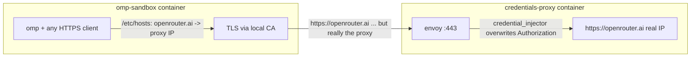

# omp-sandbox

The omp coding agent in an [OrbStack](https://orbstack.dev) (docker CLI)
sandbox with **no leakable credentials inside**.

(Previously apple/container; dropped over its bridge-ifnet collision bug,
[apple/container#2051](https://github.com/apple/container/issues/2051),
which silently kills a NAT network's egress.)



- The sandbox carries only a **dummy** `OPENROUTER_API_KEY`
  (`dummy-replaced-by-proxy`) so omp considers the provider available.
- The sandbox resolves `openrouter.ai` to the **proxy container's** address
  (`/etc/hosts`, mapped at container-create time with
  `--add-host openrouter.ai:PROXY_IP`).
- The proxy terminates TLS with a tofu-issued, infisical-stored cert handed
  to envoy purely via its environment, no key material on disk (the sandbox
  image bakes the CA into its trust store, plus `NODE_EXTRA_CA_CERTS` for Bun),
  **overwrites** the `Authorization` header with the real key, and forwards
  to actual openrouter.ai, which in *that* container resolves to the real IP.
- Bypass test: from inside the sandbox, hitting the real openrouter.ai IP
  directly with the in-sandbox key returns 401. There is nothing to leak.

## Run

```sh
./scripts/up.sh            # one command, from cold: builds (only when not built
                           # today), fresh per-session proxy in the background,
                           # foreground omp in your cwd
./scripts/up.sh bash       # plain shell instead
```

`/workspace` always mounts the monorepo root, regardless of how deep
under it you invoked the script -- the sandbox works on this one
project.

Service definitions, the network, and the proxy healthcheck live in
`../compose.yml`; up.sh runs each session as its own compose project
(`omp-sandbox-<pid>`), injects secrets through `infisical run --`, waits
for the proxy's healthcheck, discovers its address, and maps
`openrouter.ai` there via the sandbox's `extra_hosts`. Exiting the
sandbox (or Ctrl-C) triggers a trap that runs `compose down` --
everything the session created is reaped by label, so no
credential-bearing process outlives a session.

Cert rotation is absorbed by the daily staleness rebuild; same-day rotation
needs `docker image rm omp-sandbox` (buildkit never busts its cache on
build-secret contents).

## Verified

- `omp -p ...` inside the sandbox answers through the proxy (real key never
  present).
- `Authorization: Bearer bogus` through the proxy → 200 (overwrite works).
- Direct to the real endpoint with the sandbox's key → 401.
