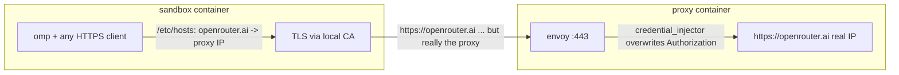

# omp-sandbox

The omp coding agent in an [OrbStack](https://orbstack.dev) (docker)
sandbox behind a credential-injecting envoy proxy, with **no leakable
credentials inside**.



- The sandbox carries only a **dummy** `OPENROUTER_API_KEY`
  (`dummy-replaced-by-proxy`) so omp considers the provider available.
- The sandbox resolves `openrouter.ai` to the **proxy container's** address
  (`/etc/hosts` via the sandbox's `extra_hosts`, set per session; see
  compose.yml for why a network alias is wrong -- the proxy would
  resolve it to itself).
- The proxy terminates TLS with a tofu-issued, infisical-stored cert handed
  to envoy purely via its environment, no key material on disk (the sandbox
  image bakes the CA into its trust store, plus `NODE_EXTRA_CA_CERTS` for Bun),
  **overwrites** the `Authorization` header with the real key, and forwards
  to actual openrouter.ai, which in *that* container resolves to the real IP.
- Bypass test: from inside the sandbox, hitting the real openrouter.ai IP
  directly with the in-sandbox key returns 401. There is nothing to leak.

(Runtime history: previously apple/container; dropped over its
bridge-ifnet collision bug,
[apple/container#2051](https://github.com/apple/container/issues/2051),
which silently kills a NAT network's egress.)

## Run

```sh
./scripts/up.sh            # one command, from cold: builds (only when not built
                           # today), fresh per-session proxy in the background,
                           # foreground omp in /workspace
./scripts/up.sh bash       # plain shell instead
```

`/workspace` always mounts the monorepo root, regardless of how deep
under it you invoked the script -- the sandbox works on this one
project.

Service definitions, the network, and the proxy healthcheck live in
`compose.yml`; up.sh runs each session as its own compose project
(`omp-sandbox-<pid>`), injects secrets through `infisical run --`, and
waits for the proxy's healthcheck, discovers its address for the
sandbox's hosts entry. Exiting the sandbox (or Ctrl-C)
triggers a trap that runs `compose down` -- everything the session
created is reaped by label, so no credential-bearing process outlives a
session.

## The proxy service

Envoy with the credential-injector filter: callers authenticate with
anything (or nothing); the real OpenRouter key is attached on this side
of the boundary. The key arrives via `infisical run` and only ever
exists in the proxy container's environment -- never in the sandbox,
never on disk.

One listener, `:443` (TLS, cert for openrouter.ai), injecting the
credential with `overwrite: true`: the sandbox resolves openrouter.ai
to this container's address, so stock clients use the real
https://openrouter.ai endpoint unchanged.

Certificates are tofu-managed
(`../agent-secrets/tofu/credentials_proxy_cert.tf`) and stored in
infisical. Rotate by applying the tofu: the next `up.sh` run rebuilds
the sandbox image (daily staleness) and starts a proxy with the new
material. Same-day rotation additionally needs
`docker image rm omp-sandbox` (buildkit never busts its cache on
build-secret contents).

For a long-lived debug proxy (out-of-session):

    infisical run -- docker compose -p debug-proxy up -d proxy

## Quick checks

PROXY_IP = a running proxy container's address
(`docker compose ps` + `docker inspect`).

    # TLS listener, exactly as the sandbox sees it: a bogus Authorization
    # header is overwritten with the real key -> 200
    curl --fail-with-body --silent --show-error \
      --cacert <(infisical secrets get CREDENTIALS_PROXY_CA_CERT --plain) \
      --resolve openrouter.ai:443:PROXY_IP \
      -H 'Authorization: wrong' https://openrouter.ai/api/v1/auth/key

Control (must be 401): `curl https://openrouter.ai/api/v1/auth/key`

## Verified

- `omp -p ...` inside the sandbox answers through the proxy (real key never
  present).
- `Authorization: Bearer bogus` through the proxy → 200 (overwrite works).
- Direct to the real endpoint with the sandbox's key → 401.
