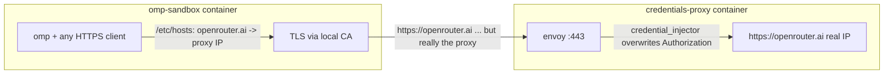

# omp-sandbox

The omp coding agent in an [apple/container](https://github.com/apple/container)
sandbox with **no leakable credentials inside**.



- The sandbox carries only a **dummy** `OPENROUTER_API_KEY`
  (`dummy-replaced-by-proxy`) so omp considers the provider available.
- The sandbox resolves `openrouter.ai` to the **proxy container's** address
  (`/etc/hosts`, written by the entrypoint from `$OPENROUTER_PROXY_IP`).
- The proxy terminates TLS with a tofu-issued, infisical-stored cert handed
  to envoy purely via its environment, no key material on disk (the sandbox
  image bakes the CA into its trust store, plus `NODE_EXTRA_CA_CERTS` for Bun),
  **overwrites** the `Authorization` header with the real key, and forwards
  to actual openrouter.ai, which in *that* container resolves to the real IP.
- Bypass test: from inside the sandbox, hitting the real openrouter.ai IP
  directly with the in-sandbox key returns 401. There is nothing to leak.

## Setup

```sh
# the CA cert is tofu-managed/infisical-stored; fetch it (and after rotations):
../credentials-proxy/fetch-ca-cert.sh
../credentials-proxy/run.sh              # starts envoy on the `agent` network

# build (context is the monorepo root — it needs credentials-proxy/certs/ca.pem)
container build --pull --no-cache \
  --tag omp-sandbox \
  --dns 203.0.113.113 \
  --file omp-sandbox/main.containerfile \
  .
```

## Run

```sh
./run.sh            # interactive omp; caller's cwd mounted at /workspace
./run.sh bash       # plain shell instead
WORKSPACE=~/project ./run.sh
```

`run.sh` discovers the proxy's current address via `container inspect` and
injects it as `OPENROUTER_PROXY_IP`; the sandbox entrypoint maps
`openrouter.ai` there. Re-run `run.sh` whenever the proxy restarts (its IP
changes); a running sandbox must be restarted too.

## Verified

- `omp -p ... --model openrouter/anthropic/claude-haiku-4.5` inside the
  sandbox answers through the proxy (real key never present).
- `Authorization: Bearer bogus` through the proxy → 200 (overwrite works).
- Direct to the real endpoint with the sandbox's key → 401.
