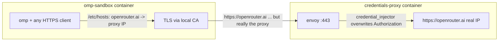

# omp-sandbox

The omp coding agent in an [apple/container](https://github.com/apple/container)
sandbox with **no leakable credentials inside**.



- The sandbox carries only a **dummy** `OPENROUTER_API_KEY`
  (`dummy-replaced-by-proxy`) so omp considers the provider available.
- The sandbox resolves `openrouter.ai` to the **proxy container's** address
  (`/etc/hosts`, written by the entrypoint from `$OPENROUTER_PROXY_IP`).
- The proxy terminates TLS with a tofu-issued, infisical-stored cert handed
  to envoy purely via its environment, no key material on disk (the sandbox
  image bakes the CA into its trust store, plus `NODE_EXTRA_CA_CERTS` for Bun),
  **overwrites** the `Authorization` header with the real key, and forwards
  to actual openrouter.ai, which in *that* container resolves to the real IP.
- Bypass test: from inside the sandbox, hitting the real openrouter.ai IP
  directly with the in-sandbox key returns 401. There is nothing to leak.

## Run

```sh
./scripts/up.sh            # one command, from cold: builds (only when not built
                           # today), fresh per-session proxy in the background,
                           # foreground omp in your cwd
./scripts/up.sh bash       # plain shell instead
WORKSPACE=~/project ./scripts/up.sh
```

The script discovers the session proxy's address via `container inspect` and
passes it as `OPENROUTER_PROXY_IP`; the sandbox entrypoint maps
`openrouter.ai` there in /etc/hosts. Exiting the sandbox (or Ctrl-C) stops
both containers via a trap -- no credential-bearing process outlives a
session, and no sandbox can point at a stale proxy address.

Cert rotation is absorbed by the daily staleness rebuild; same-day rotation
needs `container image rm omp-sandbox` (buildkit never busts its cache on
build-secret contents).

## Verified

- `omp -p ...` inside the sandbox answers through the proxy (real key never
  present).
- `Authorization: Bearer bogus` through the proxy → 200 (overwrite works).
- Direct to the real endpoint with the sandbox's key → 401.
